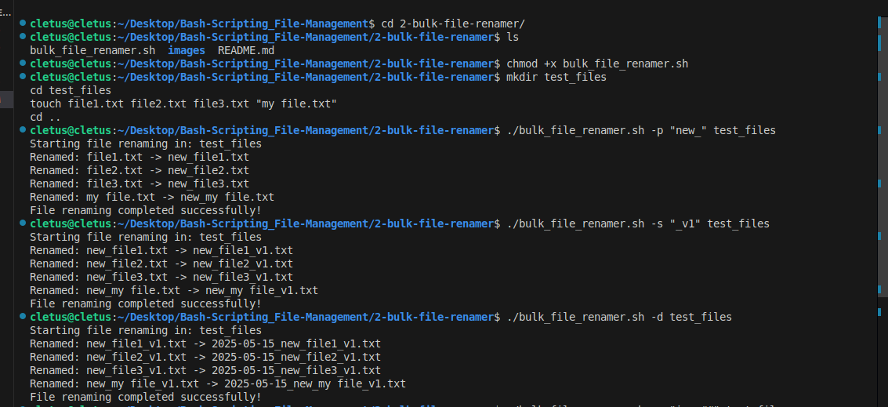
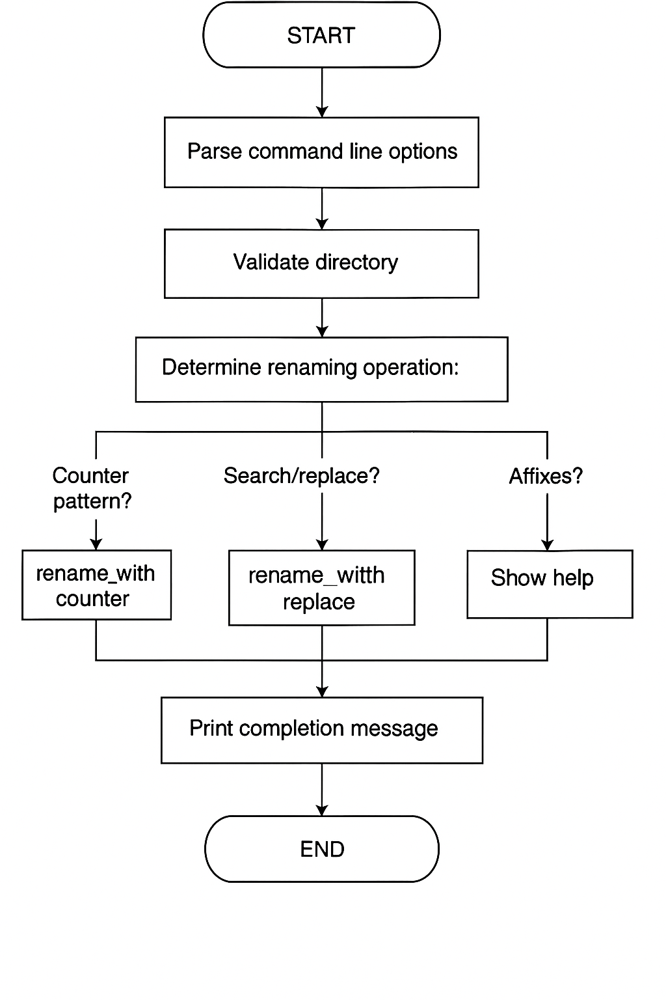

# Bulk File Renamer

A flexible, extensible Bash script to batch rename files in a directory using powerful options—prefixes, suffixes, numbering, date stamps, and search/replace functionality.

---

## Table of Contents

- [Overview](#overview)
- [Features](#features)
- [Installation](#installation)
- [Usage Guide](#usage-guide)
- [Command Line Options](#command-line-options)
- [Examples & Demos](#examples--demos)
- [How the Script Works (Technical Explanation)](#how-the-script-works-technical-explanation)
- [Flow Diagram](#flow-diagram)
- [Limitations](#limitations)
- [Future Improvements](#future-improvements)

---

## Overview

Bulk File Renamer is a command-line tool designed to automate the renaming of multiple files in a target directory. It supports a variety of renaming operations, such as adding/removing prefixes and suffixes, sequential numbering, applying date stamps, and performing text substitutions within filenames.

Ideal for organizing large collections of files such as photos, documents, or datasets.

---

## Features

- **Add Prefixes** — Insert text at the start of each filename
- **Add Suffixes** — Insert text before the file extension
- **Add Date Stamp** — Prepend the current date (YYYY-MM-DD_)
- **Sequential Numbering** — Rename files with customizable, zero-padded counters (e.g., `photo-001`, `photo-002`)
- **Search and Replace** — Replace substrings in filenames
- **Flexible Combination** — Combine options for advanced renaming tasks
- **Preserves Extensions** — File extensions are never lost or mangled

---

## Installation

1. Clone the project or Download the script as `bulk_file_renamer.sh`.
2. Make it executable:

   ```bash
   chmod +x bulk_file_renamer.sh
   ```

---

## Usage Guide

Run the script from the command line, specifying one or more options and the target directory:

```bash
./bulk_file_renamer.sh [OPTIONS] <directory>
```

- `<directory>`: The path to the folder whose files you wish to rename.
- **Options**: Choose one or more of the flags described below.

To see built-in help:

```bash
./bulk_file_renamer.sh -h
```

---

## Command Line Options

| Option | Format | Description | Example |
|--------|--------|-------------|---------|
| `-p`   | `-p PREFIX` | Add a prefix to filenames | `-p "vacation_"` |
| `-s`   | `-s SUFFIX` | Add a suffix before the file extension | `-s "_edited"` |
| `-n`   | `-n PATTERN` | Rename files using a pattern with counter (`#` as placeholder) | `-n "photo-###"` |
| `-d`   | `-d` | Add date prefix (YYYY-MM-DD_) | `-d` |
| `-r`   | `-r SEARCH REPLACE` | Replace SEARCH with REPLACE in filenames | `-r " " "_"` |
| `-h`   | `-h` | Show help message and exit | `-h` |

> ℹ️ **Note:** The script only processes files in the specified directory, not subdirectories.

---

## Examples & Demos

### 1. Add a Prefix

```bash
./bulk_renamer.sh -p "vacation_" ~/Pictures
```

Before:
```
beach.jpg
mountain.jpg
sunset.jpg
```
After:
```
vacation_beach.jpg
vacation_mountain.jpg
vacation_sunset.jpg
```

---

### 2. Add a Suffix and Date

```bash
./bulk_renamer.sh -s "_edited" -d ~/Documents
```

Before:
```
report.docx
notes.txt
```
After:
```
2025-05-14_report_edited.docx
2025-05-14_notes_edited.txt
```

---

### 3. Number Files Sequentially

```bash
./bulk_renamer.sh -n "photo-###" ~/Pictures
```

Before:
```
IMG_1234.jpg
DSC_5678.jpg
DCIM_9012.jpg
```
After:
```
photo-001.jpg
photo-002.jpg
photo-003.jpg
```

---

### 4. Replace Spaces with Underscores

```bash
./bulk_file_renamer.sh -r " " "_" ~/Documents
```

Before:
```
my document.docx
meeting notes.txt
```
After:
```
my_document.docx
meeting_notes.txt
```

---

### Visual Demo

#### Example: Numbering and Renaming (Before and After)


*Original files before applying the script.*


*Files after renaming with sequential numbering pattern.*

---

## How the Script Works (Technical Explanation)

**1. Command-Line Parsing**

The script uses `getopts` to parse options:

- `-p`: Sets a prefix to prepend to all filenames
- `-s`: Sets a suffix to add before file extensions
- `-n`: Specifies a pattern for sequential numbering using `#` placeholders
- `-d`: If present, prepends the current date in `YYYY-MM-DD_` format
- `-r`: Replaces all occurrences of a substring in filenames
- `-h`: Shows help

**2. Directory Validation**

After parsing, the script checks that the directory argument is provided and valid.

**3. Renaming Logic**

The renaming operation is prioritized as follows:

- **Numbering Pattern (`-n`)**:  
  If a pattern is specified, each file is renamed using the pattern, where each `#` is replaced by a zero-padded sequential counter.
  - E.g., `-n "img-###"` → `img-001.jpg`, `img-002.jpg`, ...
- **Search and Replace (`-r`)**:  
  If specified, all filenames have matching substrings replaced.
- **Prefix/Suffix/Date**:  
  If above options are not used, the script applies prefix, suffix, and/or date stamp.

**4. Functions**

- `rename_with_counter`: Handles the sequential numbering operation.
- `rename_with_replace`: Handles text substitution in filenames.
- `rename_with_affixes`: Handles prefix/suffix/date.

**5. Extension Handling**

The script always preserves file extensions, even as it modifies the filename portion.

---

## Flow Diagram

### Skeleton Flowchart

```
START
  |
  v
Parse command line options
  |
  v
Validate directory
  |
  v
Determine renaming operation:
  |
  +----------------+---------------+---------------+
  |                |               |               |
  v                v               v               v
Counter pattern?   Search/replace? Affixes?        Help?
  |                |               |               |
  v                v               v               v
rename_with_counter rename_with_replace rename_with_affixes Show help
  |                |               |
  +----------------+---------------+
  |
  v
Print completion message
  |
  v
END
```

### Actual Flowchart



---

## Limitations

- Only processes files in the top-level of the specified directory (no recursion).
- If two files would be renamed to the same name, one will overwrite the other—**no conflict resolution**.
- No dry-run/preview mode—changes are immediate.
- Minimal error handling for edge cases (permissions, file name collisions, special characters).

---

## Future Improvements

- Recursive (subdirectory) support
- Preview/dry-run mode before renaming
- Conflict detection and safe handling
- Support for regex-based renaming
- Undo/rollback functionality

---


### Contributions

Pull requests and feedback are welcome!

---

## Appendix: Script Structure

- **Help Function:**  
  Shows usage and examples.
- **Option Parsing:**  
  Uses `getopts` to handle flags.
- **Validation:**  
  Ensures directory exists.
- **Logic:**  
  Decides which renaming operation to invoke.
- **Three Main Operations:**  
  1. Numbering (`rename_with_counter`)
  2. Search/Replace (`rename_with_replace`)
  3. Affix/Date addition (`rename_with_affixes`)
- **Completion:**  
  Prints a summary message.

---

**For further details, read through the script comments or run with `-h` for on-demand help.**