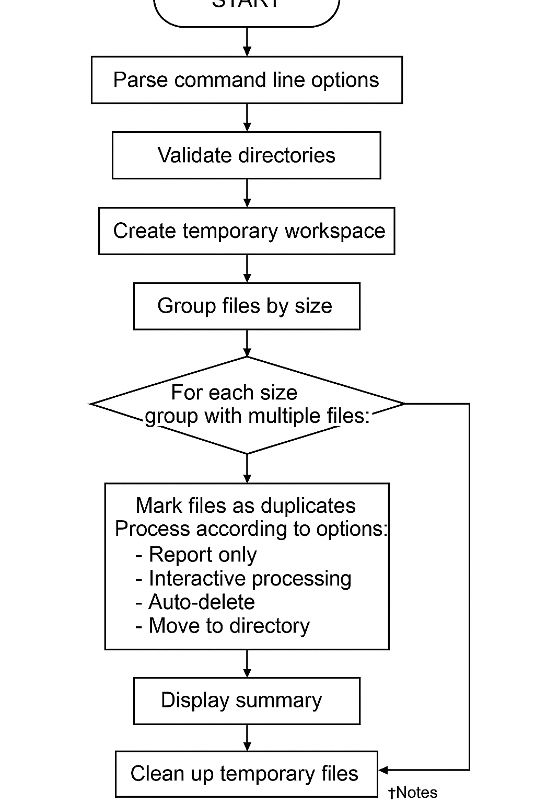
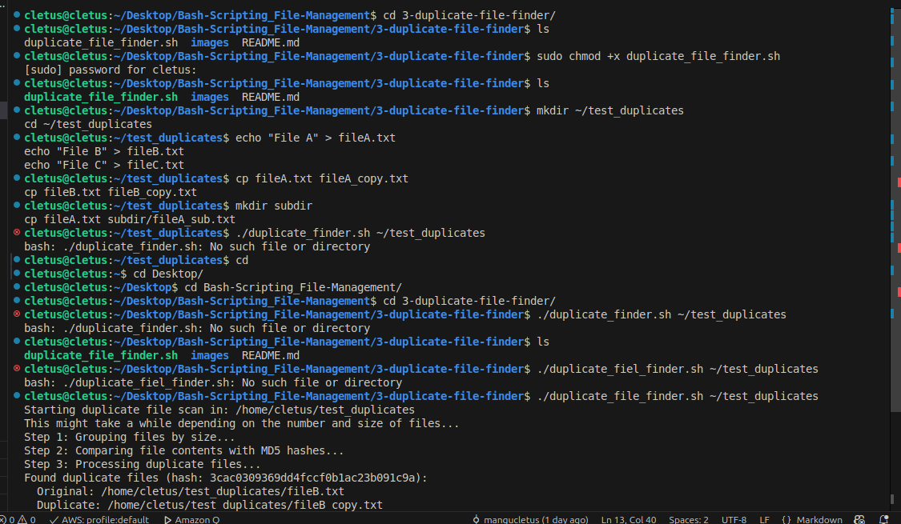
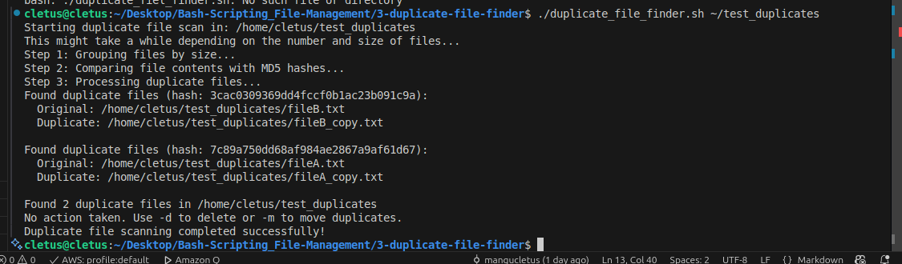

# Duplicate File Finder

This Bash script efficiently identifies and manages duplicate files in a directory, with interactive and automated options for handling duplicates.

---

## Table of Contents

- [Overview](#overview)
- [Features](#features)
- [How It Works](#how-it-works)
- [Installation & Usage](#installation--usage)
- [Command Line Options](#command-line-options)
- [Examples](#examples)
- [Demo Screenshots](#demo-screenshots)
- [Technical Details](#technical-details)
- [Limitations](#limitations)
- [Future Improvements](#future-improvements)

---

## Overview

Duplicate files can waste disk space and make file management difficult. This script helps you **find and manage duplicate files** by comparing file content, not just filenames. It uses a two-step process for efficiency:

1. **Group files by size** (since only files of the same size can be duplicates).
2. **Compare file contents** using MD5 checksums.

You can choose to **report**, **delete**, **move**, or **interactively manage** duplicates.

---

## Features

- **Content-based detection:** Finds duplicates by content, not just name.
- **Works with any file type:** Text, images, binaries, etc.
- **Recursive scanning:** Optionally scan subdirectories.
- **Interactive mode:** Decide what to do with each duplicate.
- **Automated actions:** Auto-delete or move duplicates.
- **Safe:** Always preserves the first occurrence of each file.
- **Detailed reporting:** See exactly what was found and what actions were taken.

---

## How It Works

The script follows these steps:

1. **Parse Command Line Options:** Determines user preferences (interactive, delete, move, recursive).
2. **Validate Directories:** Ensures the target and (if needed) move directories exist.
3. **Create Temporary Workspace:** Stores intermediate groupings.
4. **Group Files by Size:** Uses `stat` to group files with identical sizes.
5. **Group by Content:** For each size group, uses `md5sum` to group files with identical content.
6. **Process Duplicates:** Depending on options, reports, deletes, moves, or prompts for each duplicate.
7. **Summary and Cleanup:** Reports results and removes temporary files.

### Flow Diagram

```
START
  |
  v
Parse command line options
  |
  v
Validate directories
  |
  v
Create temporary workspace
  |
  v
Group files by size
  |
  v
For each size group with multiple files:
  |  Calculate MD5 hashes
  |  Group files by hash
  |
  v
For each hash group with multiple files:
  |  Mark files as duplicates
  |  Process according to options:
  |    - Report only
  |    - Interactive processing
  |    - Auto-delete
  |    - Move to directory
  |
  v
Display summary
  |
  v
Clean up temporary files
  |
  v
END
```

#### Actual Flow Diagram



---

## Installation & Usage

### 1. Download the Script

Save the script as `duplicate_file_finder.sh`.

### 2. Make it Executable

```bash
chmod +x duplicate_file_finder.sh
```

### 3. Run the Script

```bash
./duplicate_file_finder.sh [OPTIONS] /path/to/directory
```

---

## Command Line Options

| Option | Format      | Description                                 | Example                  |
|--------|-------------|---------------------------------------------|--------------------------|
| `-i`   | `-i`        | Interactive mode                            | `-i`                     |
| `-d`   | `-d`        | Auto-delete duplicates                      | `-d`                     |
| `-m`   | `-m DIR`    | Move duplicates to DIR                      | `-m ~/Duplicates`        |
| `-r`   | `-r`        | Scan recursively                            | `-r`                     |
| `-h`   | `-h`        | Show help message                           | `-h`                     |

---

## Examples

### Basic scan (report only)

```bash
./duplicate_file_finder.sh ~/Documents
```
*Scans the Documents folder and reports duplicates, but takes no action.*

### Interactive mode with recursive scanning

```bash
./duplicate_file_finder.sh -r -i ~/Pictures
```
*Scans Pictures and subdirectories, prompting for each duplicate.*

### Auto-delete duplicates

```bash
./duplicate_file_finder.sh -d ~/Downloads
```
*Deletes all duplicates in Downloads, keeping the first occurrence.*

### Move duplicates to another folder

```bash
./duplicate_file_finder.sh -m ~/Duplicates ~/Music
```
*Moves duplicates from Music to the Duplicates folder.*

---

## Demo Screenshots

Below are screenshots showing the script in action:

**1. Duplicate Detection Output**



**2. Interactive Mode Prompt**



---

## Technical Details

### File Uniqueness

- **File Size:** Uses `stat -c %s` to get file size in bytes.
- **File Content:** Uses `md5sum` to generate a hash of the file content.
- **Efficiency:** Only files with the same size are compared by content, minimizing unnecessary hash calculations.

### Temporary Files Structure

- **`size_XXXXX`:** Lists files with the same size (XXXXX = size in bytes).
- **`hash_XXXXX`:** Lists files with the same MD5 hash (XXXXX = hash).

### Memory and Performance

- **Batch Processing:** Files are grouped and processed in batches to minimize memory usage.
- **Recursive Option:** Scanning subdirectories can increase processing time.
- **Cleanup:** Temporary files are deleted automatically when the script exits.

### Script Structure Explained

- **Option Parsing:** Uses `getopts` for robust command-line argument handling.
- **Validation:** Checks for valid directories and creates move directory if needed.
- **File Discovery:** Uses `find` for efficient file listing, with or without recursion.
- **Grouping:** Files are grouped by size, then by hash, using temporary files.
- **Duplicate Handling:** Depending on options, duplicates are reported, deleted, moved, or handled interactively.
- **User Prompts:** In interactive mode, users can choose to keep, delete, or move each duplicate.
- **Reporting:** At the end, a summary is displayed showing the number of duplicates found and actions taken.

---

## Limitations

- Does **not** check for hard links or symbolic links.
- Very large files may slow down processing.
- MD5 has a very small chance of hash collisions (rare in practice).
- No built-in way to ignore certain file types or directories.
- Does not compare files across multiple source directories in one run.

---

## Future Improvements

- Option to export duplicate lists in CSV format.
- Ability to exclude certain directories or file types.
- Parallel processing for faster scanning.
- Progress indicators for large directories.
- Support for comparing files across multiple source directories.

---

## Troubleshooting

- **Permission Denied:** Ensure you have read/write permissions for the target directory and files.
- **Move Directory Issues:** The script will attempt to create the move directory if it does not exist.
- **Large Directories:** For very large directories, allow extra time for processing.

---

## Contributing

Pull requests and suggestions are welcome! Please open an issue for bugs or feature requests.


