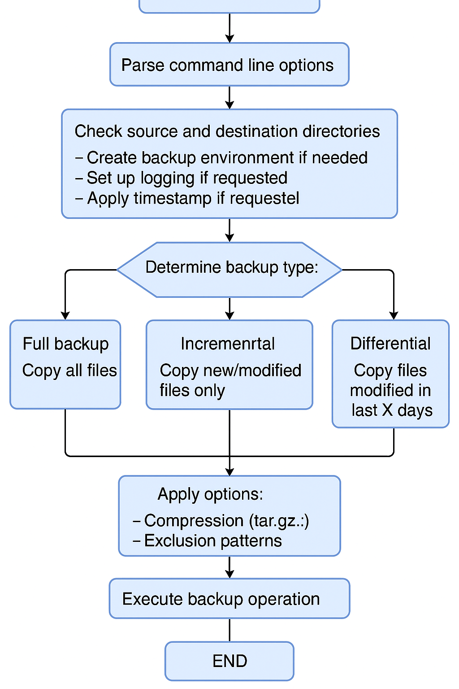
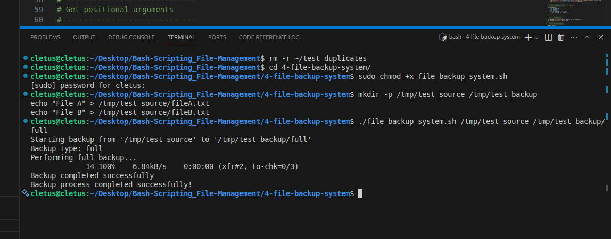
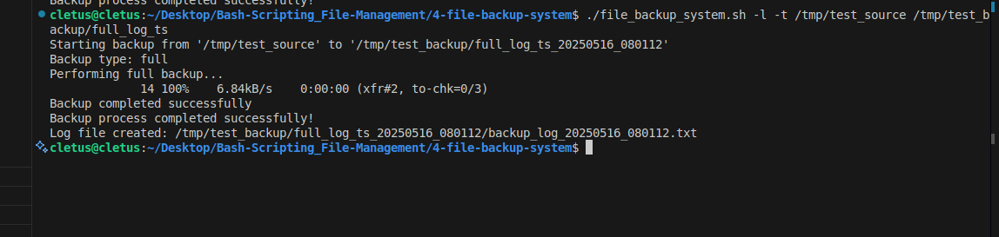
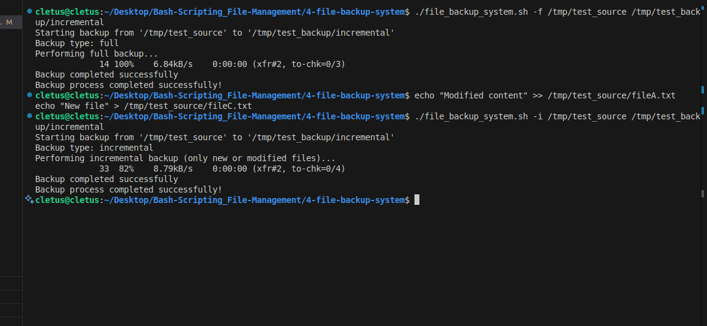
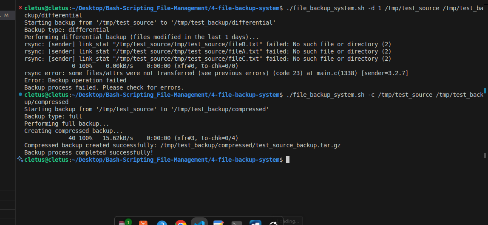

# File Backup System

A flexible Bash script for backing up important files and directories, supporting full, incremental, and differential backups with advanced options for compression, logging, exclusion, and timestamping.

---

## Table of Contents

- [Overview](#overview)
- [Features](#features)
- [Requirements](#requirements)
- [How to Use](#how-to-use)
- [Command Line Options](#command-line-options)
- [Examples](#examples)
- [Understanding Backup Types](#understanding-backup-types)
- [Flow Diagram](#flow-diagram)
- [Demo Screenshots](#demo-screenshots)
- [Log File Format](#log-file-format)
- [Technical Details](#technical-details)
- [Limitations](#limitations)
- [Future Improvements](#future-improvements)
- [Setting Up Scheduled Backups](#setting-up-scheduled-backups)
- [Troubleshooting](#troubleshooting)
- [Contributing](#contributing)
- [License](#license)

---

## Overview

This File Backup System script helps you create reliable backups of important directories and files. It supports **full**, **incremental**, and **differential** backups, with options for compression, logging, timestamped backup directories, and file exclusion patterns. The script is designed to be simple to use, yet powerful and customizable for advanced users.

---

## Features

- **Multiple backup types:**
  - **Full backup:** Copies all files from the source.
  - **Incremental backup:** Copies only new or modified files since the last backup.
  - **Differential backup:** Copies files modified within a specified number of days.
- **Compression:** Optionally create `.tar.gz` archives for space savings.
- **Detailed logging:** Generate log files for each backup operation.
- **Timestamped backups:** Add timestamps to backup directory names for easy tracking.
- **File exclusion:** Exclude files or patterns (e.g., `*.tmp`) from backups.
- **Simple CLI:** Easy-to-use command-line interface with clear options.
- **Safe:** Does not overwrite source files and validates directories before backup.

---

## Requirements

- **Bash shell**
- **rsync** (for efficient file copying and synchronization)
- **tar** (for compression)

---

## How to Use

1. **Make the script executable:**
   ```bash
   chmod +x file_backup_system.sh
   ```

2. **Run the script with source and destination directories:**
   ```bash
   ./file_backup_system.sh [OPTIONS] <source_directory> <backup_directory>
   ```

   - `<source_directory>`: The directory you want to back up.
   - `<backup_directory>`: The destination directory where backups will be stored.

---

## Command Line Options

| Option | Format         | Description                                              | Example                |
|--------|---------------|----------------------------------------------------------|------------------------|
| `-f`   | `-f`          | Full backup (default)                                    | `-f`                   |
| `-i`   | `-i`          | Incremental backup (only new/modified files)             | `-i`                   |
| `-d`   | `-d DAYS`     | Differential backup (files modified in last DAYS days)   | `-d 7`                 |
| `-c`   | `-c`          | Compress the backup into a `.tar.gz` archive             | `-c`                   |
| `-l`   | `-l`          | Create a log file of the backup operation                | `-l`                   |
| `-t`   | `-t`          | Add timestamp to backup directory name                   | `-t`                   |
| `-e`   | `-e PATTERN`  | Exclude files matching PATTERN (e.g., `*.tmp`)           | `-e "*.tmp"`           |
| `-h`   | `-h`          | Show help message                                        | `-h`                   |

---

## Examples

### Simple Full Backup

```bash
./file_backup_system.sh ~/Documents ~/Backups
```
*Copies all files from `Documents` to `Backups`.*

### Compressed Backup with Timestamp

```bash
./file_backup_system.sh -c -t ~/Pictures ~/Backups
```
*Creates a compressed archive of `Pictures` in a timestamped directory under `Backups`.*

### Incremental Backup with Logging

```bash
./file_backup_system.sh -i -l ~/Projects ~/Backups
```
*Copies only new or modified files from `Projects` to `Backups` and creates a detailed log file.*

### Differential Backup (Last 7 Days)

```bash
./file_backup_system.sh -d 7 -c ~/Documents ~/Backups
```
*Backs up only files modified in the last 7 days from `Documents` and compresses them.*

### Exclude Temporary Files

```bash
./file_backup_system.sh -e "*.tmp" ~/Work ~/Backups
```
*Backs up `Work` but excludes all `.tmp` files.*

---

## Understanding Backup Types

### Full Backup

Copies **all files** from the source to the destination, regardless of modification time. Use this for a complete backup.

### Incremental Backup

Copies **only files that are new or have changed** since the last backup. Efficient for regular backups, as it minimizes data transfer.

### Differential Backup

Copies **files modified within a specified number of days** (e.g., last 7 days). Useful for capturing recent changes without a full backup.

---

## Skeleton Flow Diagram

```
START
  |
  v
Parse command line options
  |
  v
Check source and destination directories
  |
  v
Set up backup environment:
  - Create destination directory if needed
  - Set up logging if requested
  - Apply timestamp if requested
  |
  v
Determine backup type:
  +----------------+----------------+----------------+
  |                |                |                |
  v                v                v
Full backup    Incremental      Differential
Copy all files  Copy new/modified  Copy files modified
                files only         in last X days
  |                |                |
  +----------------+----------------+
  |
  v
Apply options:
  - Compression (tar.gz)
  - Exclusion patterns
  |
  v
Execute backup operation
  |
  v
Log results and clean up
  |
  v
END
```

### Actual Flow Diagram



---

## Demo Screenshots

Below are screenshots showing the script in action:

**1. Default Backup**



**2. Full Backup**



**3. Incremental Backup**



**4. Differential Backup and Compression**



---

## Log File Format

If logging is enabled (`-l` option), the script creates a log file with the following information:

```
Backup started at [date and time]
Source: [source directory]
Destination: [backup directory]
Backup type: [full/incremental/differential]
[Additional parameters if applicable]
Compression: [Enabled/Disabled]
----------------------------------------
[Operation messages and file listings]
----------------------------------------
Backup finished at [date and time]
Status: [SUCCESS/FAILED]
```

---

## Technical Details

### Using rsync

The script uses `rsync` for file copying because it is:
- **Efficient:** Only copies changed files.
- **Reliable:** Preserves file attributes and permissions.
- **Flexible:** Supports exclusion patterns and progress reporting.

### Compression

When compression is enabled (`-c`):
1. Files are first copied to a temporary directory using `rsync`.
2. The temporary directory is archived into a `.tar.gz` file using `tar`.
3. The archive is placed in the backup directory.
4. Temporary files are cleaned up automatically.

### Exclusion Patterns

Use the `-e` option to exclude files or directories matching a pattern (e.g., `*.tmp`, `node_modules/`). This is passed directly to `rsync`'s `--exclude` option.

### Timestamped Backups

The `-t` option appends a timestamp (format: `YYYYMMDD_HHMMSS`) to the backup directory name, making it easy to keep multiple backup versions.

### Logging

If `-l` is specified, all actions and results are logged to a timestamped log file in the backup directory.

---

## Limitations

- Does **not** manage backup rotation or automatically prune old backups.
- No built-in scheduling (use `cron` for automation).
- Incremental backups do **not** track previous backup states (uses file modification times).
- No built-in verification of backup integrity after creation.
- Does not support remote backups (local filesystem only).

---

## Future Improvements

- Add backup verification and integrity checks.
- Implement backup rotation and automatic pruning of old backups.
- Add restore functionality for easy recovery.
- Support encryption for secure backups.
- Add multi-threaded compression for large backups.
- Support remote backups (e.g., via SSH or cloud storage).

---

## Setting Up Scheduled Backups

You can use `cron` to schedule regular backups. For example, to run a backup every day at 2 AM:

1. Open your crontab:
   ```bash
   crontab -e
   ```

2. Add a line like:
   ```bash
   0 2 * * * /path/to/file_backup_system.sh -i -l -t ~/Documents ~/Backups
   ```

This will run an incremental backup with logging and timestamping every day at 2 AM.

---

## Troubleshooting

- **Permission Denied:** Ensure you have read/write permissions for both source and backup directories.
- **Missing Dependencies:** Make sure `rsync` and `tar` are installed (`sudo apt install rsync tar`).
- **Backup Directory Issues:** The script will attempt to create the backup directory if it does not exist.
- **No Files Found:** For differential backups, ensure files have been modified within the specified days.

---

## Contributing

Pull requests and suggestions are welcome! Please open an issue for bugs or feature requests.

---

