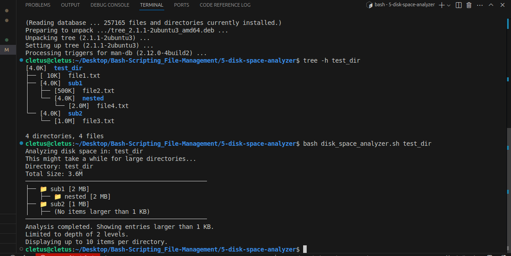
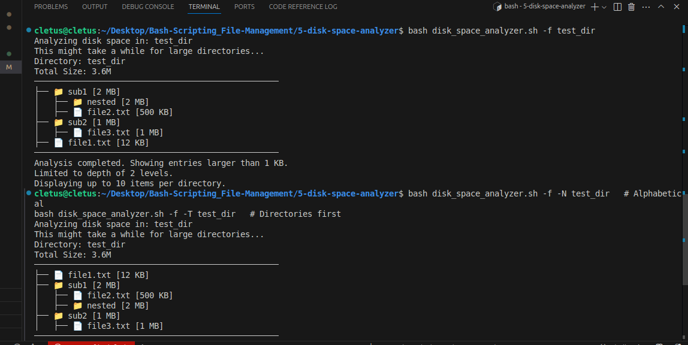

# Disk Space Analyzer

A robust Bash script that analyzes disk usage and displays results in a tree-like structure, helping you quickly identify large folders and files.

---

## Table of Contents

- [Overview](#overview)
- [Features](#features)
- [How to Use](#how-to-use)
- [Command Line Options](#command-line-options)
- [Examples](#examples)
- [Understanding the Output](#understanding-the-output)
- [Flow Diagram](#flow-diagram)
- [Demo Screenshots](#demo-screenshots)
- [Technical Details](#technical-details)
- [Limitations](#limitations)
- [Future Improvements](#future-improvements)
- [Common Issues](#common-issues)

---

## Overview

The Disk Space Analyzer script helps you visualize disk usage in any directory. It recursively scans folders, calculates their sizes, and presents the results in a clear, tree-like format. This makes it easy to spot which directories or files are consuming the most space.

---

## Features

- **Tree-like visualization:** See disk usage in a hierarchical structure.
- **Configurable depth:** Limit how deep the scan goes into subdirectories.
- **Top N entries:** Show only the largest items per directory.
- **Minimum size filter:** Ignore small files/folders to focus on big space consumers.
- **Flexible sorting:** Sort by size, name, or type (directories first).
- **Human-readable sizes:** Output in B, KB, MB, GB, or TB.
- **Include/exclude files:** Choose to analyze only folders or both files and folders.
- **Safe and non-destructive:** Only reads disk usage, never modifies files.

---

## How to Use

1. **Make the script executable:**
   ```bash
   chmod +x disk_space_analyzer.sh
   ```

2. **Run the script with your target directory:**
   ```bash
   ./disk_space_analyzer.sh [OPTIONS] /path/to/directory
   ```

---

## Command Line Options

| Option | Format      | Description                                 | Default         |
|--------|------------|---------------------------------------------|-----------------|
| `-d`   | `-d DEPTH` | Maximum depth to display                    | 2               |
| `-n`   | `-n NUMBER`| Show top N entries per directory            | 10              |
| `-s`   | `-s SIZE`  | Minimum size to display (KB)                | 1               |
| `-f`   | `-f`       | Include files in the output                 | Folders only    |
| `-S`   | `-S`       | Sort by size (largest first)                | Default         |
| `-N`   | `-N`       | Sort by name (alphabetically)               |                 |
| `-T`   | `-T`       | Sort by type (directories first)            |                 |
| `-h`   | `-h`       | Show help message                           |                 |

---

## Examples

### Basic Usage

```bash
./disk_space_analyzer.sh /home/user
```
*Scans `/home/user` to a depth of 2 directories and shows the top 10 largest items in each directory.*

### Detailed Analysis

```bash
./disk_space_analyzer.sh -d 3 -n 5 -f /var/log
```
*Scans `/var/log` to a depth of 3, shows the top 5 largest items per directory, and includes files in the analysis.*

### Focus on Large Files

```bash
./disk_space_analyzer.sh -s 1000 -S ~/Documents
```
*Scans `~/Documents`, only shows items larger than 1000 KB (1 MB), sorted by size.*

---

## Understanding the Output

The script produces a tree-like output with size information:

```
Directory: /home/user
Total Size: 15G
───────────────────────────────────────────────────
├── 📁 Documents [5.2GB]
│   ├── 📁 Projects [3.1GB]
│   ├── 📁 Reports [1.5GB]
│   ├── 📁 Archive [600MB]
│   │   
├── 📁 Downloads [4.7GB]
│   ├── 📁 Software [2.3GB]
│   ├── 📄 large_dataset.zip [1.2GB]
│   ├── 📄 movie.mp4 [850MB]
│   │   
├── 📁 Pictures [3.5GB]
│   ├── 📁 Vacation2024 [2.1GB]
│   ├── 📁 Family [800MB]
│   ├── 📁 Screenshots [400MB]
│   │   
───────────────────────────────────────────────────
Analysis completed. Showing entries larger than 1 KB.
Limited to depth of 2 levels.
Displaying up to 10 items per directory.
```

- **📁** = Directory
- **📄** = File

---

## Flow Diagram

```
START
  |
  v
Parse command line options
  |
  v
Validate directory
  |
  v
Get total directory size
  |
  v
Create temporary workspace
  |
  v
Analyze root directory
  |  |
  |  +---> For each entry in directory:
  |  |       - Calculate size
  |  |       - Filter by minimum size
  |  |       - Add to list for current level
  |  |
  |  +---> Sort entries based on sort option
  |  |
  |  +---> Display top N entries
  |  |
  |  +---> For each directory entry:
  |          Recursively analyze (if depth < max_depth)
  |
  v
Display summary
  |
  v
Clean up temporary files
  |
  v
END
```

### Actual Flow Diagram


---

## Demo Screenshots

Below are screenshots showing the script in action:

**1. Disk Usage Analysis Output**



**2. Tree Structure with Files Included**



---

## Technical Details

### Size Calculation

- **Directories:** Uses `du -sk` to get the total size (in KB) including all subdirectories.
- **Files:** Uses `ls -sk` to get the file size (in KB).
- **Efficiency:** All sizes are initially in kilobytes for speed.

### Human-Readable Size Formatting

The script converts raw byte counts to human-readable formats (B, KB, MB, GB, TB) using this logic:
1. Start with size in bytes and unit = "B"
2. While size ≥ 1024 and we haven't reached TB:
   - Divide size by 1024
   - Move to next unit
3. Display size with appropriate unit

### Sorting Mechanisms

- **Size sorting:** `sort -t'|' -k1 -nr` (numerically by size, largest first)
- **Name sorting:** `sort -t'|' -k2` (alphabetically by name)
- **Type sorting:** `sort -t'|' -k4 -r` (directories first)

### Temporary Workspace

- The script creates a temporary directory for intermediate files and ensures cleanup on exit.

### Indentation and Tree Drawing

- Uses Unicode box-drawing characters and emoji for a clear, readable tree structure.
- Indentation is handled by a helper function for consistent formatting.

---

## Limitations

- Can be slow for very large directories with many files.
- No progress indication during analysis.
- Limited to local filesystems.
- Emoji icons (📁, 📄) may not display correctly in all terminals.
- Does not follow symbolic links.

---

## Future Improvements

- Add progress indicator for large directories.
- Implement caching for faster re-analysis.
- Add export options (CSV, JSON).
- Create graphical visualization of disk usage.
- Add ability to exclude specific directories or file types.
- Implement interactive mode for directory navigation.

---

## Common Issues

### Permission Denied Errors

When scanning system directories, you might encounter "permission denied" errors. Run the script with sudo for full access:

```bash
sudo ./disk_space_analyzer.sh /var
```

### Slow Performance

For very large directories, use the minimum size filter to focus on larger items:

```bash
./disk_space_analyzer.sh -s 10000 /home
```
*This will only show items larger than 10MB, speeding up the analysis.*

---

## Troubleshooting

- **Script fails to run:** Ensure you have execute permissions (`chmod +x disk_space_analyzer.sh`).
- **Strange characters in output:** Your terminal may not support Unicode/emoji.
- **Missing dependencies:** The script relies on standard Linux utilities (`du`, `ls`, `sort`, `awk`).

---

## Contributing

Pull requests and suggestions are welcome! Please open an issue for bugs or feature requests.

---