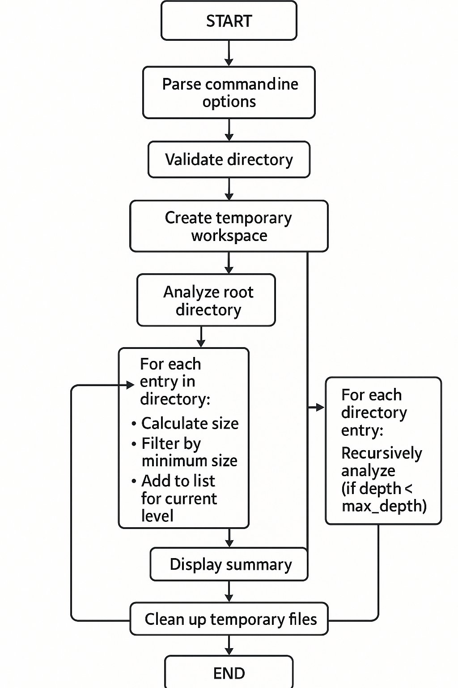

# Disk Space Analyzer

A bash script that analyzes disk usage and displays results in a tree-like structure.

## Overview

The Disk Space Analyzer is a bash script that helps you identify what's consuming space on your disk. It scans directories and presents the results in a hierarchical tree format, making it easy to spot large folders and files.

## Features

- Tree-like visualization of disk usage
- Configurable depth of directory scanning
- Show top N largest items per directory
- Filter by minimum file size
- Multiple sorting options (by size, name, or type)
- Human-readable size formatting (B, KB, MB, GB, TB)
- Option to include or exclude files from the analysis

## How to Use

1. Make the script executable:
   ```
   chmod +x disk_space_analyzer.sh
   ```

2. Run the script with the target directory:
   ```
   ./disk_space_analyzer.sh [OPTIONS] /path/to/directory
   ```

## Command Line Options

| Option | Format | Description | Default |
|--------|--------|-------------|---------|
| `-d` | `-d DEPTH` | Maximum depth to display | 2 |
| `-n` | `-n NUMBER` | Show top N entries per directory | 10 |
| `-s` | `-s SIZE` | Minimum size to display (KB) | 1 |
| `-f` | `-f` | Include files in the output | Folders only |
| `-S` | `-S` | Sort by size (largest first) | Default |
| `-N` | `-N` | Sort by name (alphabetically) | |
| `-T` | `-T` | Sort by type (directories first) | |
| `-h` | `-h` | Show help message | |

## Examples

### Basic Usage

```bash
./disk_space_analyzer.sh /home/user
```

This will scan `/home/user` to a depth of 2 directories and show the top 10 largest items in each directory.

### Detailed Analysis

```bash
./disk_space_analyzer.sh -d 3 -n 5 -f /var/log
```

This will:
- Scan `/var/log` to a depth of 3 directories
- Show the top 5 largest items in each directory
- Include files in the analysis

### Focus on Large Files

```bash
./disk_space_analyzer.sh -s 1000 -S ~/Documents
```

This will:
- Scan `~/Documents`
- Only show items larger than 1000 KB (1 MB)
- Sort by size (largest first)

## Understanding the Output

The script produces a tree-like output with size information:

```
Directory: /home/user
Total Size: 15G
───────────────────────────────────────────────────
├── 📁 Documents [5.2GB]
│   ├── 📁 Projects [3.1GB]
│   ├── 📁 Reports [1.5GB]
│   ├── 📁 Archive [600MB]
│   │   
├── 📁 Downloads [4.7GB]
│   ├── 📁 Software [2.3GB]
│   ├── 📄 large_dataset.zip [1.2GB]
│   ├── 📄 movie.mp4 [850MB]
│   │   
├── 📁 Pictures [3.5GB]
│   ├── 📁 Vacation2024 [2.1GB]
│   ├── 📁 Family [800MB]
│   ├── 📁 Screenshots [400MB]
│   │   
───────────────────────────────────────────────────
Analysis completed. Showing entries larger than 1 KB.
Limited to depth of 2 levels.
Displaying up to 10 items per directory.
```

## Flow Diagram

```
START
  |
  v
Parse command line options
  |
  v
Validate directory
  |
  v
Get total directory size
  |
  v
Create temporary workspace
  |
  v
Analyze root directory
  |  |
  |  +---> For each entry in directory:
  |  |       - Calculate size
  |  |       - Filter by minimum size
  |  |       - Add to list for current level
  |  |
  |  +---> Sort entries based on sort option
  |  |
  |  +---> Display top N entries
  |  |
  |  +---> For each directory entry:
  |          Recursively analyze (if depth < max_depth)
  |
  v
Display summary
  |
  v
Clean up temporary files
  |
  v
END
```
## Actual Flow Diagram



## Technical Details

### Size Calculation

- For directories: Uses `du -sk` to get the total size including all subdirectories
- For files: Uses `ls -sk` to get the file size
- All sizes are initially in kilobytes for efficiency

### Human-Readable Size Formatting

The script converts raw byte counts to human-readable formats (B, KB, MB, GB, TB) using this logic:
1. Start with size in bytes and unit = "B"
2. While size ≥ 1024 and we haven't reached TB:
   - Divide size by 1024
   - Move to next unit
3. Display size with appropriate unit

### Sorting Mechanisms

The script supports three sorting methods:
- **Size sorting**: Uses `sort -t'|' -k1 -nr` to sort numerically by the first field (size) in reverse order
- **Name sorting**: Uses `sort -t'|' -k2` to sort alphabetically by the second field (name)
- **Type sorting**: Uses `sort -t'|' -k4 -r` to sort by the fourth field (is_dir flag) in reverse order

## Limitations

- The script can be slow for very large directories with many files
- No progress indication during analysis
- Limited to local filesystems
- Emoji icons (📁, 📄) may not display correctly in all terminals

## Future Improvements

- Add progress indicator for large directories
- Implement caching for faster re-analysis
- Add export options (CSV, JSON)
- Create graphical visualization of disk usage
- Add ability to exclude specific directories or file types
- Implement interactive mode for directory navigation

## Common Issues

### Permission Denied Errors

When scanning system directories, you might encounter "permission denied" errors. Run the script with sudo for full access:

```bash
sudo ./disk_space_analyzer.sh /var
```

### Slow Performance

For very large directories, use the minimum size filter to focus on larger items:

```bash
./disk_space_analyzer.sh -s 10000 /home
```

This will only show items larger than 10MB, speeding up the analysis.