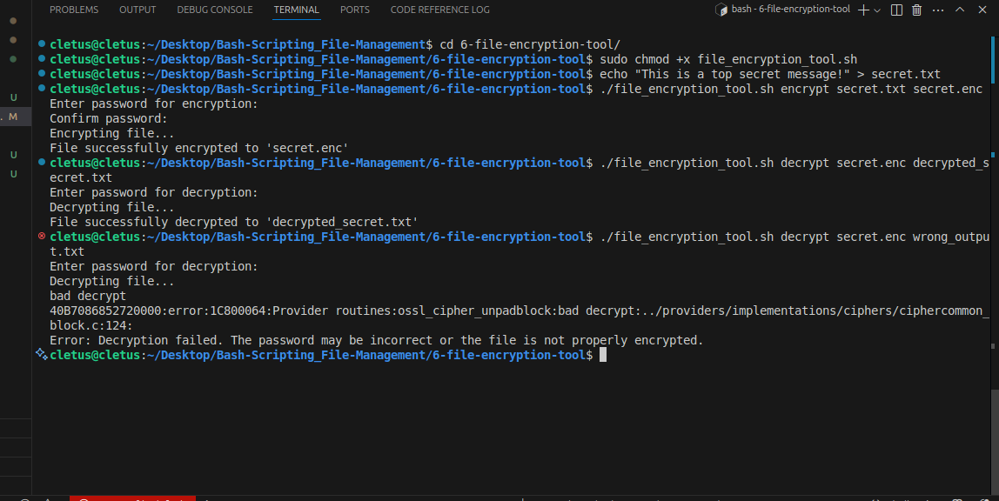
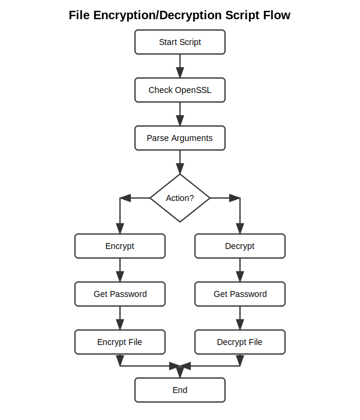

# File Encryption Tool 

A Bash script for secure file encryption and decryption using OpenSSL's AES-256-CBC cipher, PBKDF2 key derivation, and strong password-based protection.

---

## Table of Contents

- [Overview](#overview)
- [Requirements](#requirements)
- [Installation](#installation)
- [Features](#features)
- [Usage](#usage)
- [Examples](#examples)
- [How It Works](#how-it-works)
- [Technical Details](#technical-details)
- [Security Considerations](#security-considerations)
- [Limitations](#limitations)
- [Demo Screenshots](#demo-screenshots)
- [Troubleshooting](#troubleshooting)
- [Flow Diagram](#flow-diagram)
- [Best Practices](#best-practices)
- [Further Improvements](#further-improvements)

---

## Overview

This documentation covers a Bash script for encrypting and decrypting files using OpenSSL's AES-256-CBC encryption algorithm with password-based protection. The script is designed for simplicity, security, and portability, making it suitable for both personal and professional use cases where file confidentiality is required.

---

## Requirements

- **Bash shell** (Linux, macOS, or WSL on Windows)
- **OpenSSL** (must be installed and available in your `$PATH`)
  - Check with: `openssl version`
- **Standard Unix utilities**: `read`, `echo`, `command`, etc.

---

## Installation

1. CLone the project or Download the `file_encryption_tool.sh` script to your computer.
2. Make it executable:
   ```bash
   chmod +x file_encryption_tool.sh
   ```
3. (Optional) Move it to a directory in your `$PATH` for global access.

---

## Features

- **AES-256-CBC encryption**: Strong, industry-standard symmetric cipher.
- **Password-based encryption/decryption**: No key files required.
- **Salted encryption**: Adds randomness to prevent rainbow table attacks.
- **PBKDF2 key derivation**: Uses 10,000 iterations for slow brute-force resistance.
- **Hidden password input**: Prevents password leakage via terminal.
- **Error handling**: Detects missing dependencies, mismatched passwords, and failed operations.
- **No plaintext password on disk**: Password is only in memory during execution.
- **Simple CLI**: Minimal, clear command-line interface.

---

## Usage

### Command Syntax

```bash
./file_encryption_tool.sh [encrypt|decrypt] [input_file] [output_file]
```

- `encrypt`: Encrypts the input file and writes the result to the output file.
- `decrypt`: Decrypts the input file and writes the result to the output file.
- `[input_file]`: Path to the file to encrypt or decrypt.
- `[output_file]`: Path to save the encrypted or decrypted file.

### Arguments

- **Action**: `encrypt` or `decrypt`
- **Input file**: File to be encrypted or decrypted (must exist)
- **Output file**: Destination for the resulting file (will be overwritten if exists)

---

## Examples

**Encrypt a file:**
```bash
./file_encryption_tool.sh encrypt secret.txt secret.enc
```
- Prompts for a password (twice for confirmation).
- Produces `secret.enc` as the encrypted output.

**Decrypt a file:**
```bash
./file_encryption_tool.sh decrypt secret.enc secret_decrypted.txt
```
- Prompts for the password.
- Produces `secret_decrypted.txt` if the password is correct.

---

## How It Works

### Encryption Process

1. **Dependency Check**: Verifies that OpenSSL is installed using `command -v openssl`.
2. **Input Validation**: Checks that the input file exists and is a regular file.
3. **Password Prompt**: Securely prompts for a password (twice for confirmation) using `read -s`.
4. **OpenSSL Invocation**:
   - Uses `openssl enc -aes-256-cbc -salt -pbkdf2 -iter 10000`.
   - Reads the password from stdin (`-pass stdin`).
   - Writes the encrypted output to the specified file.
5. **Result Handling**: Checks the exit status of OpenSSL and reports success or failure.

### Decryption Process

1. **Dependency Check**: Verifies OpenSSL is installed.
2. **Input Validation**: Checks that the encrypted file exists.
3. **Password Prompt**: Securely prompts for the password.
4. **OpenSSL Invocation**:
   - Uses `openssl enc -d -aes-256-cbc -pbkdf2 -iter 10000`.
   - Reads the password from stdin.
   - Writes the decrypted output to the specified file.
5. **Result Handling**: If decryption fails, deletes any partial output and reports an error.

---

## Technical Details

### OpenSSL Command Options

- `enc`: OpenSSL's symmetric encryption command.
- `-aes-256-cbc`: 256-bit AES in CBC mode.
- `-salt`: Adds an 8-byte random salt to the output (stored in the file header).
- `-pbkdf2`: Uses PBKDF2 for key derivation (recommended over legacy EVP_BytesToKey).
- `-iter 10000`: 10,000 PBKDF2 iterations for increased brute-force resistance.
- `-pass stdin`: Reads password from standard input (not from command line or environment).

### Password Handling

- Password is never echoed to the terminal (`read -s`).
- For encryption, password is confirmed by entering it twice.
- For decryption, password is entered once.
- Password is not stored on disk or in environment variables.

### File Handling

- Input file must exist and be readable.
- Output file will be created or overwritten.
- On decryption failure, any partial output is deleted to avoid confusion.

### Security Model

- **Confidentiality**: Ensured by AES-256-CBC and strong password derivation.
- **Integrity**: Not provided—no HMAC or hash is used. (See Limitations)
- **Authentication**: Not provided—anyone with the password can decrypt.

---

## Security Considerations

| Feature            | Description                                   | Benefit                                 |
|--------------------|-----------------------------------------------|-----------------------------------------|
| AES-256-CBC        | Strong symmetric encryption                   | Protects sensitive files                |
| Password-based     | User supplies password                        | No key files to lose or manage          |
| Salt               | Random data added to encryption               | Prevents rainbow table attacks          |
| PBKDF2             | Key derivation with 10,000 iterations         | Slows brute-force attacks               |
| Hidden password    | Password input is not echoed                  | Prevents shoulder-surfing               |

**Important:** The security of your data depends on the strength and secrecy of your password. Use long, random, and unique passwords.

---

## Limitations

- **No file integrity verification**: The script does not add a hash or HMAC. Corrupted or tampered files may not be detected.
- **Password in memory**: The password is stored in memory during execution, but not on disk.
- **No password recovery**: If you forget your password, the data is unrecoverable.
- **No compression**: Files are not compressed before encryption.
- **Not suitable for highly regulated or extremely sensitive data**: For such use cases, consider tools with authenticated encryption and integrity checks.

---

## Demo Screenshot

Below is a screenshot showing the script in action:

**1. Encryption Prompt and Output**




---

## Troubleshooting

| Problem                        | Solution                                                                 |
|---------------------------------|--------------------------------------------------------------------------|
| "OpenSSL is not installed"      | Install OpenSSL (`sudo apt install openssl` or `brew install openssl`)   |
| "Passwords do not match"        | Re-run and ensure both password entries are identical                    |
| "Decryption failed"             | Check password and file integrity; ensure correct file and password      |
| "Input file does not exist"     | Verify the file path and try again                                       |

---

## Flow Diagram

```
┌─────────────────┐
│ Start Script    │
└────────┬────────┘
         │
┌────────▼────────┐
│ Check OpenSSL   │
└────────┬────────┘
         │
┌────────▼─────────┐
│ Parse Arguments  │
└────────┬─────────┘
         │
         ▼
    ┌────────┐
    │ Action?│
    └┬──────┬┘
     │      │
┌────▼─┐  ┌─▼────┐
│Encrypt│  │Decrypt│
└───┬───┘  └───┬──┘
    │          │
┌───▼───┐   ┌──▼────┐
│Get    │   │Get    │
│Password│  │Password│
└───┬───┘   └───┬───┘
    │           │
┌───▼───┐    ┌──▼────┐
│Encrypt│    │Decrypt │
│File   │    │File    │
└───┬───┘    └───┬───┘
    │            │
    └─────┬──────┘
          │
    ┌─────▼─────┐
    │    End    │
    └───────────┘
```

### Actual Flow Diagram



---

## Best Practices

1. **Use strong, unique passwords** for each file or set of files.
2. **Store encrypted files securely** (e.g., in a safe location or cloud storage).
3. **Back up your files** before encryption to avoid accidental data loss.
4. **Remember your passwords**—there is no recovery process.
5. **For highly sensitive data**, consider additional security measures (e.g., file integrity checks, hardware tokens, or using authenticated encryption modes like GCM).

---

## Further Improvements

- Add file integrity verification (e.g., HMAC or hash).
- Support key files in addition to passwords.
- Add compression before encryption for space savings.
- Provide a more user-friendly or interactive interface.
- Support batch encryption/decryption.
- Implement authenticated encryption (e.g., AES-GCM).

---

## Contributing

Pull requests and suggestions are welcome! Please open an issue for bugs or feature requests.

---

