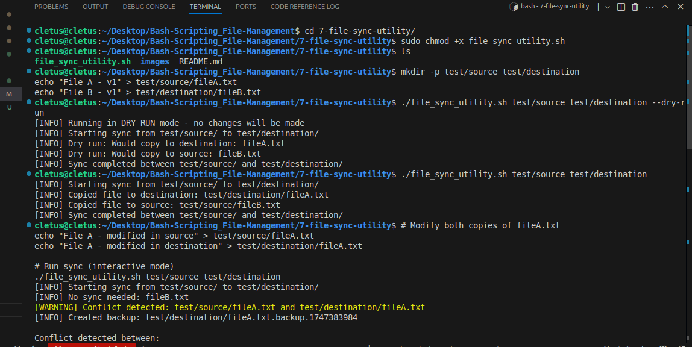
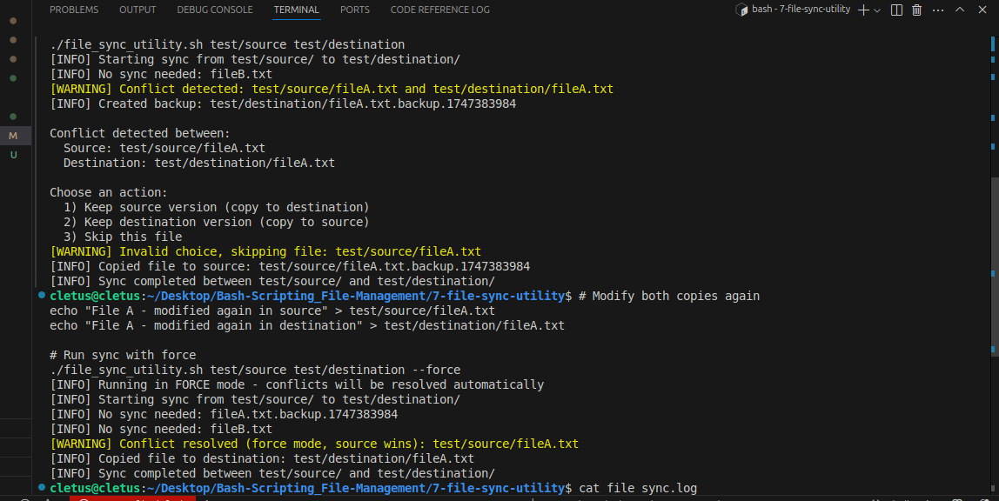
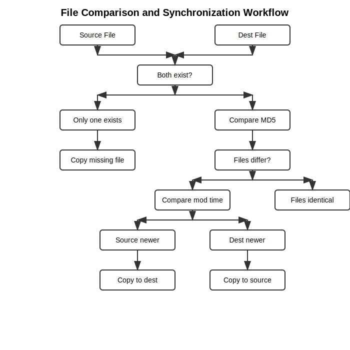

# File Sync Utility Documentation

## Overview

The **File Sync Utility** is a robust Bash script for **bidirectional (two-way) synchronization** of files between two directories. It ensures both folders reflect the latest changes, propagates updates in both directions, and handles conflicts with backup and user intervention. The script is designed for reliability, transparency, and safety, with detailed logging, dry-run, and force modes.

---

## Features

- **Two-way synchronization**: Propagates changes from both folders, not just one-way.
- **Conflict detection and resolution**: Detects when both files have changed and offers resolution options.
- **Automatic backup of conflicted files**: Prevents data loss during conflicts.
- **Detailed logging**: All actions and errors are logged with timestamps and severity.
- **Dry-run mode**: Preview changes without applying them.
- **Force mode**: Automatically resolve conflicts by preferring source files.
- **Support for nested directory structures**: Recursively syncs all subfolders.
- **Interactive conflict resolution**: Prompts user for action when not in force mode.
- **Preserves file permissions and timestamps**.

---

## Requirements

- Bash shell (tested on Linux and macOS)
- Standard Unix utilities: `find`, `md5sum`, `stat`, `cp`, `mkdir`, `date`
- File read/write permissions in both directories

---

## Installation

1. Download the `file_sync.sh` script to your computer.
2. Make it executable:
   ```bash
   chmod +x file_sync.sh
   ```
3. (Optional) Move it to a directory in your `$PATH` for global access.

---

## Usage

### Basic Command Structure

```bash
./file_sync.sh [source_folder] [destination_folder] [options]
```

### Available Options

| Option        | Description                                                        |
|---------------|--------------------------------------------------------------------|
| `--dry-run`   | Show what would be done without making actual changes              |
| `--force`     | Automatically resolve conflicts by preferring source files         |
| `--help`      | Display help information                                           |

### Examples

**Basic synchronization:**
```bash
./file_sync.sh ~/Documents/folder1 ~/Documents/folder2
```

**Preview changes without modifying files:**
```bash
./file_sync.sh ~/Documents/folder1 ~/Documents/folder2 --dry-run
```

**Force synchronization (auto-resolve conflicts):**
```bash
./file_sync.sh ~/Documents/folder1 ~/Documents/folder2 --force
```

---

## How It Works

### Synchronization Process

1. **Scan the source directory** for all files (excluding hidden files).
2. For each file, **compare with the corresponding file** in the destination directory:
   - If only one exists, copy it to the other side.
   - If both exist, compare their MD5 checksums:
     - If identical, do nothing.
     - If different, compare modification times:
       - If source is newer, copy to destination.
       - If destination is newer, copy to source.
       - If both changed (same timestamp, different content), handle as a conflict.
3. **Scan the destination directory** for files not present in the source and copy them back if needed.
4. **Log all actions** to both the console and a log file.

---

## Technical Details

### Major Script Components

#### 1. Logging

- **log_message(level, message)**: Logs messages to both the console and a log file (`file_sync.log`). Uses color coding for error and warning messages. Each log entry includes a timestamp and severity (`INFO`, `WARNING`, `ERROR`).

#### 2. File Existence and Metadata

- **file_exists(path)**: Checks if a file exists.
- **get_mod_time(path)**: Returns the last modification time of a file in seconds since epoch, using `stat`. Compatible with both GNU and BSD stat.

#### 3. File Comparison

- **compare_files(source, dest)**: Determines sync action by:
  - Checking existence of both files.
  - Comparing MD5 checksums for content equality.
  - Comparing modification times if content differs.
  - Returns a code indicating which file is newer or if a conflict exists.

#### 4. File Copying

- **copy_file(source, dest, direction)**: Copies a file, preserving permissions and timestamps. Logs the action. Ensures the destination directory exists.

#### 5. Conflict Handling

- **handle_conflict(source, dest)**:
  - If `--force` is set, source always wins.
  - Otherwise, creates a backup of the destination file and prompts the user to resolve the conflict interactively (unless in dry-run mode).

#### 6. Synchronization Core

- **sync_files(source_dir, dest_dir)**:
  - Recursively scans and compares files in both directions.
  - Calls `compare_files` and takes action based on the result.
  - Handles files that exist only in the destination as well.

#### 7. Main Script Logic

- Parses command-line arguments and sets flags for dry-run and force modes.
- Validates input directories and creates the destination if missing.
- Calls `sync_files` to perform the synchronization.

---

## File Comparison Logic

The script uses a combination of existence checks, modification times, and MD5 checksums to determine the state of files:

```
┌───────────────┐     ┌───────────────┐
│ Source File   │     │  Dest File    │
└───────┬───────┘     └───────┬───────┘
        │                     │
        │   ┌───────────────┐ │
        └───┤  Both exist?  ├─┘
            └───────┬───────┘
                    │
         ┌──────────┴─────────┐
         │                    │
┌────────▼───────┐   ┌────────▼───────┐
│ Only one exists │   │  Compare MD5   │
└────────┬───────┘   └────────┬───────┘
         │                    │
┌────────▼───────┐   ┌────────▼───────┐
│  Copy missing  │   │ Files differ?  │
│     file      │   └────────┬───────┘
└────────────────┘            │
                    ┌─────────┴─────────┐
                    │                   │
           ┌────────▼───────┐  ┌────────▼───────┐
           │Compare mod time│  │Files identical │
           └────────┬───────┘  └────────────────┘
                    │
        ┌───────────┴────────────┐
        │                        │
┌───────▼────────┐      ┌────────▼───────┐
│ Source newer   │      │  Dest newer    │
└───────┬────────┘      └────────┬───────┘
        │                        │
┌───────▼────────┐      ┌────────▼───────┐
│Copy to dest    │      │Copy to source  │
└────────────────┘      └────────────────┘
```

---

## Conflict Resolution

When a conflict is detected (both files modified since last sync):

1. A backup of the destination file is automatically created (with a timestamp).
2. If in force mode, the source file is used.
3. If in interactive mode, the user is prompted to choose:
   - Keep source version (copy to destination)
   - Keep destination version (copy to source)
   - Skip this file

---

## Logging

All actions are logged to both the console and a log file (`file_sync.log`) with timestamps and severity levels:

- `INFO`: Normal operations
- `WARNING`: Potential issues that were handled
- `ERROR`: Failed operations or critical issues

Example log entry:
```
[2025-05-14 10:15:23] [INFO] Copied file to destination: /path/to/destination/file.txt
```

---

## Demo Screenshots

Below are screenshots showing the script in action:

**1. Synchronization Output**



**2. Conflict Resolution Prompt**



---

## Limitations and Considerations

- **Performance**: For large directories with many files, the script may take significant time to run.
- **Permissions**: The script must have read/write access to both directories.
- **Binary Files**: While the script can sync binary files, conflict resolution is better suited for text files.
- **Network Drives**: Syncing across network drives may be slow and more error-prone.
- **Symbolic Links**: The current implementation doesn't handle symbolic links specially.
- **Hidden Files**: Files that start with a dot (.) are ignored by default.

---

## Error Handling

The script includes error handling for common scenarios:

- Non-existent directories
- Permission issues
- Failed file operations

Each error is logged with details to help diagnose the issue.

---

## Best Practices

1. **Start with Dry Run**: Always use `--dry-run` first to see what changes would be made.
2. **Regular Syncs**: Frequent synchronization reduces the chance of conflicts.
3. **Backup First**: Before first sync, consider backing up both directories.
4. **Avoid Syncing System Files**: Don't use this utility for system directories.
5. **Check Logs**: Review the `file_sync.log` file after each run.

---

## Advanced Usage Scenarios

### Scheduled Synchronization

You can set up a cron job to run the sync at regular intervals:

```bash
# Run sync every hour
0 * * * * /path/to/file_sync.sh /path/to/source /path/to/destination --force >> /path/to/cron.log 2>&1
```

### One-way Sync Alternative

If you need one-way sync (similar to backup), you can use the script with `--force` option and always use the same source and destination order.

---

## Troubleshooting

| Issue | Possible Solution |
|-------|-------------------|
| "Source directory does not exist" | Check the path and permissions |
| "Failed to create destination directory" | Check write permissions in parent directory |
| "Failed to copy" | Check file permissions and disk space |
| Script is very slow | Reduce the number of files or use more efficient tools for large directories |
| Too many conflicts | Sync more frequently or reconsider your workflow |

---

## Actual Flow Diagram



---

## Future Improvements

- Add exclusion patterns for files/directories
- Implement file deletion syncing
- Add compression for network transfers
- Store last sync state to improve conflict detection
- Add progress indicators for large directories
- Support for remote syncing via SSH

---

## Security Considerations

- **Data Loss Prevention**: The script creates backups of conflicted files before overwriting.
- **No Encryption**: Data is transferred and stored as-is; use additional tools if encryption is required.
- **No Integrity Verification**: Relies on MD5 for content comparison, but does not provide cryptographic integrity guarantees.
- **No Authentication**: Anyone with access to both directories can modify files.

---

## Script Structure and Flow

### Main Functions

- **log_message**: Handles all logging with color and timestamps.
- **show_help**: Prints usage and options.
- **file_exists / get_mod_time**: File existence and metadata utilities.
- **compare_files**: Determines sync action (identical, source newer, dest newer, conflict).
- **copy_file**: Copies files, preserves metadata, logs actions.
- **handle_conflict**: Manages backup and user/force resolution of conflicts.
- **sync_files**: Orchestrates the two-way sync process.

### Script Flow

1. Parse arguments and set flags.
2. Validate and prepare directories.
3. Announce dry-run or force mode if set.
4. Call `sync_files` to perform the sync.
5. Log all actions and errors.

---

## Contributing

Pull requests and suggestions are welcome! Please open an issue for bugs or feature requests.

---

